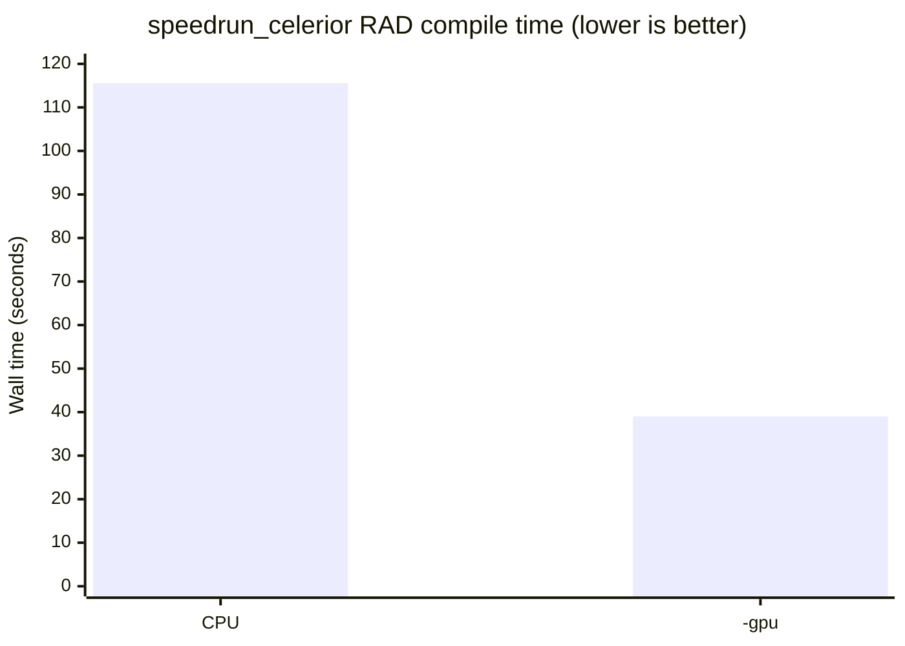
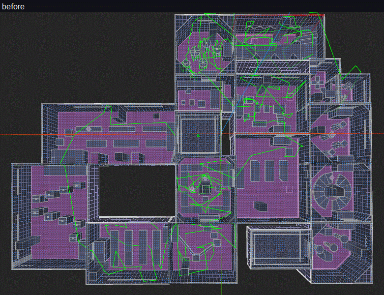
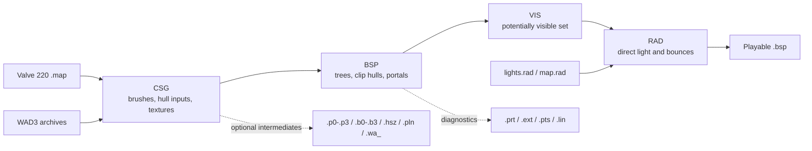
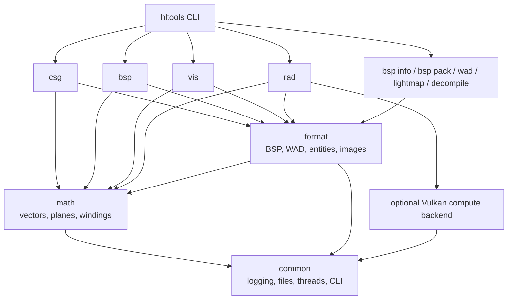

# hltools

hltools is a modern rewrite of the [SDHLT](https://github.com/seedee/SDHLT/) tools, focused on faster compilation, clearer diagnostics, new map and asset utilities.

The toolchain preserves established compiler behavior and map compatibility while using a cleaner architecture, reusable libraries and a unified command line interface. `hltools compile` is the primary compilation workflow.

Compiler stages are exposed as `hltools csg`, `hltools bsp`, `hltools vis` and
`hltools rad`; there are no separate stage executables.

## Work in progress

Under development. Bugs, incomplete behavior and output differences may still occur, especially on maps and features not yet covered by fixtures and automated tests.

## Project status

| Command | Status | Purpose |
|---|---:|---|
| `hltools compile` | Complete | Run CSG, BSP, VIS, RAD in one process |
| `hltools csg` | Complete | Parse MAP files, carve brushes, build hull inputs, resolve WAD textures |
| `hltools bsp` | Complete | Build BSP trees, clip hulls, portals, leak diagnostics and face extents |
| `hltools vis` | Complete | Compute and compress the potentially visible set |
| `hltools rad` | Complete | CPU radiosity lighting plus optional approximate Vulkan GPU gathering |
| `hltools bsp info` | Complete | Inspect BSP stages, entities, textures, WAD references and engine limits |
| `hltools bsp pack` | Available | Package a BSP and referenced assets as a game-directory tree or ZIP with a `.res` file |
| `hltools wad` | Complete | List, extract and build WAD3 texture archives; accepts WAD or BSP input |
| `hltools lightmap` | Complete | Export all face lightmaps and styles to a deterministic 24-bit BMP atlas |
| `hltools decompile` | Complete | Decompile GoldSrc BSPs or port Source BSPs to GoldSrc MAP, WAD, and asset output |
| `hltools ripent` | Planned | Import and export entity and texture lumps |
| `hltools model` | Available | Convert Source studio models and build full-resolution GoldSrc skybox models |

The CPU compiler stages preserve reference compiler behavior across real maps and feature fixtures. GPU RAD is deliberately approximate; see [Accuracy and compatibility](#accuracy-and-compatibility).

## GPU lighting

GPU accelerated RAD is one of the largest additions. \
With `-gpu`, Vulkan compute handles direct light gathering and transfer form factors, significantly reducing lighting and total compile times on supported maps. Unsupported maps automatically use the CPU path.

Measured on `speedrun_celerior` from the same snapshot after CSG, BSP and VIS, using a Release build with `-extra -threads 12` on a Ryzen 5 5600H and an RTX 3050 Laptop GPU. Both values average two alternating runs.



| Path | Run 1 | Run 2 | Average |
|---|---:|---:|---:|
| CPU | 115.518 s | 115.547 s | 115.533 s |
| `-gpu` | 39.447 s | 38.635 s | 39.041 s |

On this map, `-gpu` is 2.96x faster and reduces RAD wall time by 66.2%.

## Leak diagnostics

Leak diagnostics were reworked. \
The new diagnostics point directly at the opening that needs to be fixed.



- The `.pts` pointfile follows the geometrically shortest route from the leaked entity to the outside.
- The hole is marked with a visible cross and its coordinates are printed.
- All leaking hulls are consolidated into one report.
- `-leakonly` stops immediately after writing the diagnostics.

## Lightmap atlas budget (AllocBlock)

GoldSrc packs lightmapped faces into 64 pages of 128x128 luxels. If they do not fit, the engine aborts with `AllocBlock: full`.

This early budget check was added in hltools. RAD runs it before direct light creation, light gathering, or bounce computation, so an impossible map fails before the expensive lighting work begins. \
Above 95% it prints a breakdown by texture ranked by lightmap footprint.

hltools tests several legal face orders against the same AllocBlock algorithm before writing the BSP and keeps the order that needs the fewest pages. Node and marksurface references are remapped safely. This slightly reduces packing gaps without changing geometry, texture scale or lightmap resolution. The engine still uses its original fixed 64 page allocator.

```text
!!! ERROR: LIGHTMAP ATLAS OVERFLOW - map exceeds the engine's 64 page limit
    usage    71 / 64 pages (111%)
    cause    too many lightmapped luxels; the engine aborts with "AllocBlock: full"
    action   raise the texture scale on the biggest consumers below, or make them smaller

    Lightmap atlas budget by texture (top consumers):
      texture                  faces       luxels  % budget
      --------------------------------------------------------------
      dev_r3_cs2y2             2,258      242,850     72.0%
      dev_c3_dhmsl0            1,702      119,917     36.6%
```

The exact luxel totals identify the textures to fix. Page usage can be slightly higher because atlas packing leaves gaps between rectangles.

## Building

Compiled Release archives for Windows and Linux are available from successful GitHub Actions runs. \
Each run provides the supported `hltools` artifact. Builds from `main` are also
published to the rolling [nightly release](https://github.com/speedrun-16/hltools/releases/tag/nightly).

Requirements:

- CMake 3.21 or newer.
- A C++17 compiler. Visual Studio 2022 is the primary Windows configuration.
- Optional GPU backend: `glslc` from the Vulkan SDK and a device with Vulkan support.

The build downloads pinned libzip and zlib sources and links them statically for
embedded map-source archives. GPU support is enabled automatically when `glslc`
is available. The first GPU build also downloads pinned Vulkan headers into
`build/_extern`. Use `-DHLTOOLS_GPU=OFF` for a CPU only build.

The commands below start in the repository root.

### Windows

```powershell
cmake -S . -B build -G "Visual Studio 17 2022" -A x64
cmake --build build --config Release
./bin/hltools.exe -h
```

To build only the unified executable and its dependencies:

```powershell
cmake --build build --config Release --target hltools
```

### Linux

```bash
cmake -S . -B build -DCMAKE_BUILD_TYPE=Release
cmake --build build --parallel
./bin/hltools -h
```

The complete build also produces verification executables in `bin/tests`.

## Compilation workflow



`hltools compile` runs this pipeline in one process with a single combined log. \
The individual stage commands remain available when an editor or script expects the traditional workflow.

## Quick start

Compile a map with the CPU reference path:

```powershell
hltools compile maps/example.map
```

Fast iteration compile. In the unified command, `-fast` is seen by both VIS and RAD:

```powershell
hltools compile -fast maps/example.map
```

High quality lightmaps with GPU gathering:

```powershell
hltools compile -extra -gpu maps/example.map
```

Run the stages individually:

```powershell
hltools csg maps/example.map
hltools bsp maps/example
hltools vis maps/example
hltools rad -extra maps/example
```

Run `hltools <command> -h` for the authoritative option list. Options may appear before or after the map name for individual compiler commands.

## Source studio-model conversion

`hltools model convert` rebuilds a Source studio model as one self-contained
GoldSrc v10 MDL:

```powershell
hltools model convert cstrike/models/props/crate.mdl models/crate.mdl -game cstrike
```

The Source `.mdl` must have its sibling `.vvd` and `.dx90.vtx`, `.dx80.vtx`, or
`.vtx` file beside it. The converter reads LOD 0, embeds palettized skins up to
512x512, preserves bones and supported animation sequences, and automatically
splits geometry that exceeds GoldSrc's per-submodel vertex limit. Source models
with versions 44 through 49 are supported.

`-game` points at the Source content directory used to resolve VMT/VTF skins
from loose files and `_dir.vpk` archives. It is inferred when the input path is
under a `models` directory. Unresolved skins are replaced with an obvious purple
placeholder and reported after conversion. Use `-force` to overwrite an output.

## Full-resolution skybox models

GoldSrc's normal `gfx/env` sky path is conventionally limited to 256x256 faces.
`hltools model skybox` can instead turn six high-resolution TGA faces into a
large studio-model cube:

```powershell
hltools model skybox gfx/env/night models/night_sky -size 131072
```

The input files are
`night{up,lf,ft,rt,bk,dn}.tga`. Studio skins are limited to 512x512, so a
1024x1024 face is losslessly divided into four skins. The resulting cube uses
24 skins and 48 triangles; no face is resized. GoldSrc permits at most 64 skins
in one model, so larger skies are automatically divided across
`night_sky0.mdl`, `night_sky1.mdl`, and so on. Place one `cycler_sprite` for
every emitted model at the same origin.

The model skins carry `FLATSHADE`, `FULLBRIGHT`, and `NOMIPS`. `FULLBRIGHT`
makes a light entity unnecessary on engines that implement the standard studio
flags; placing a white light in the model room is still a harmless compatibility
fallback. RAD's default is already `-limiter 255`.

A reliable map setup is:

- Build a small sealed room in the void, preferably near the map origin.
- Put every `cycler_sprite` and an `info_overview_point` in that room.
- Set `reverse` to `1` on `info_overview_point`, so every leaf sees the
  model's leaf.
- Set worldspawn `MaxRange` to at least `200000`.

When porting a Source BSP, export native-sized faces first. `-skysize` supports
power-of-two sizes through 4096 for this workflow:

```powershell
hltools decompile source.bsp staging/map.map -game path/to/game -skysize 1024
hltools model skybox staging/gfx/env/night staging/models/night_sky
```

## Command reference

### `compile`

```text
hltools compile [options] <map>
```

Accepts all CSG, BSP, VIS and RAD options, plus:

| Option | Effect |
|---|---|
| `-dumpintermediates` | Write the CSG intermediate files instead of keeping only the memory handoff |
| `-noembedsource` | Do not append the editable map-source ZIP to the BSP |
| `-nochart` | Skip the final BSP usage chart |
| `-threads <n>` | Set the shared worker count; the default uses all cores |

`-onlyents` is intentionally supported only by CSG and is rejected by `hltools compile`.

Map source is embedded by default. The root `source.map` is self-contained:
it contains the effective `info_compile_parameters` and only the effective
`info_texlights` definitions for textures referenced by compiled faces.

`info_compile_parameters` uses stage-prefixed keys. Boolean options use `1`;
value options contain the option value:

```text
{
"classname" "info_compile_parameters"
"vis_fast" "1"
"rad_extra" "1"
"rad_bounce" "12"
}
```

The entity supplies stage-specific defaults to both `hltools compile` and the
individual `hltools csg`, `bsp`, `vis`, and `rad` commands. An actual
command-line value wins. In a traditional stage chain the entity travels
through intermediate BSPs so each stage can consume its keys, then RAD removes
it from the runtime entity lump. Commands operating on an embedded final BSP
read the recipe from its root MAP instead.

> [!NOTE]
> **Changed default:** `AAATRIGGER` render faces are now preserved by default, and the old `-nonullifytrigger` option was removed. Pass `-nullifytrigger` to get the previous default behavior that strips trigger faces to NULL.
>
> **Changed default:** Exact full visibility is now the default instead of requiring `-full`. It culls best, and its tighter source clipping usually prunes the portal flow enough to also run faster than normal visibility. `-full` is still accepted for existing command lines; pass `-nofull` to get the previous default behavior.
>
> **Changed default:** Every used texture is now embedded in the BSP, so a compiled map is self contained, and the old `-nowadtextures` option was removed. Pass `-wadtextures` to get the previous default behavior that leaves textures in the WADs and records those paths on worldspawn for the engine to load at runtime. Embedding leaves no runtime WAD list, so `-nowadautodetect` and `-wadinclude` only take effect together with `-wadtextures` and CSG warns when they are passed alone. `-wadcfgfile` and `-wadconfig` still apply either way, because they select the WADs the textures are read from.

<details>
<summary><strong>CSG options</strong></summary>

### `csg`

```text
hltools csg [options] <map>
```

| Group | Option | Effect |
|---|---|---|
| Textures | `-wadtextures` | Reference textures from the WADs at runtime instead of embedding them in the BSP |
| Textures | `-wadinclude <name>` | Embed textures from WAD paths matching `name`; repeatable |
| Textures | `-nowadautodetect` | Keep unused WADs in the written worldspawn WAD list |
| Textures | `-wadcfgfile <file>` | Read WAD paths from a configuration file |
| Textures | `-wadconfig <name>` | Select a named block from the WAD configuration |
| Geometry | `-cliptype <type>` | `smallest`, `normalized`, `simple`, `precise`, or `legacy`; default `simple` |
| Geometry | `-noclip` | Do not create clipping hulls |
| Geometry | `-noskyclip` | Do not grow invisible clip copies from sky brushes |
| Geometry | `-scale <n>` | Scale the whole map around the origin |
| Geometry | `-worldextent <n>` | Set the world bounds per axis; default `65536` |
| Geometry | `-brushunion <n>` | Warn when the overlap ratio exceeds `n`; `0.1` means 10% |
| Geometry | `-hullfile <file>` | Load custom clipping hull sizes |
| Geometry | `-nullfile <file>` | Nullify faces belonging to listed classnames or targetnames |
| Geometry | `-nullifytrigger` | Convert AAATRIGGER faces to NULL instead of preserving their render models |
| Entities | `-onlyents` | Replace only the entity lump of an existing BSP |
| Entities | `-nolightopt` | Keep redundant named lights instead of stripping their targetnames |
| Misc | `-threads <n>` | Set worker threads |

</details>

<details>
<summary><strong>BSP options</strong></summary>

### `bsp`

```text
hltools bsp [options] <map>
```

| Group | Option | Effect |
|---|---|---|
| Tree | `-maxnodesize <n>` | Split oversized nodes axially; default `1024` |
| Tree | `-subdivide <n>` | Maximum face subdivision size; default `240` |
| Tree | `-noopt` | Keep unused planes and texinfo entries |
| Tree | `-noclipnodemerge` | Do not merge duplicate clipnodes |
| Tree | `-notjunc` | Disable T junction fixing |
| Tree | `-nobrink` | Disable brink fixing for convex clip hull edges |
| Hulls | `-noclip` | Do not build clipping hulls |
| Hulls | `-nohull2` | Skip hull 2 for large monsters |
| Fill | `-nofill` | Skip outside filling and leak detection |
| Fill | `-noinsidefill` | Keep enclosed pockets that contain no entity |
| Fill | `-leakonly` | Stop after detecting and reporting a leak |
| Misc | `-nonulltex` | Render NULL faces normally instead of stripping them |
| Misc | `-threads <n>` | Set the shared worker count |

</details>

<details>
<summary><strong>VIS options</strong></summary>

### `vis`

```text
hltools vis [options] <map>
```

| Option | Effect |
|---|---|
| `-nofull` | Normal instead of exact full visibility (the old SDHLT default) |
| `-fast` | Approximate visibility for iteration builds |
| `-nofixprt` | Skip the portal file rewrite compatible with J.A.C.K. |
| `-threads <n>` | Set worker threads |
| `-maxdistance <n>` | Recognized but not implemented; currently stops with an explicit error |

</details>

<details>
<summary><strong>RAD options</strong></summary>

### `rad`

```text
hltools rad [options] <map>
```

Quality and performance:

| Option | Effect | Default |
|---|---|---|
| `-extra` | Use a 3 by 3 sample grid for each lightmap luxel and raise the bounce default to `12`. An explicit `-bounce` value takes precedence and `-fast` disables both effects | Off |
| `-fast` | Use faster sample gathering while disabling bounce lighting and soft sky sampling | Off |
| `-gpu` | Use approximate Vulkan compute for direct light gathering and scalar transfer form factors. Unsupported work falls back to the CPU | Off |
| `-bounce <n>` | Set the number of radiosity bounce passes. `-fast` forces the value to `0` | `8` or `12` with `-extra` |
| `-chop <n>` | Set the base patch size for surfaces that are not accurate texlight emitters | `64` |
| `-texchop <n>` | Set the base patch size for accurate texlight emitters | `32` |
| `-vismatrix <type>` | Select `normal` for a dense matrix limited to 65,535 patches, `sparse` for a sparse matrix with a higher patch limit or `off` to test visibility while transfers are built without storing a matrix | `sparse` |
| `-compress <0..2>` | Select scalar transfer storage: `0` = 32 bit, `1` = packed 16 bit or `2` = packed 8 bit. Used when `-rgbtransfers` is off | `1` |
| `-rgbcompress <0..3>` | Select RGB transfer storage: `0` = 96 bit, `1` = 48 bit, `2` = 32 bit or `3` = 24 bit. Used only with `-rgbtransfers` | `2` |
| `-incremental` | Read or write `<map>.inc` transfer data. A cache is accepted when its patch count matches, so remove the file after geometry or transfer setting changes | Off |

Brightness and color:

| Option | Effect |
|---|---|
| `-scale <n>` | Global light intensity scale; default `2.0` |
| `-colourscale <r g b>` | Intensity scale for each color channel |
| `-gamma <n>` | Lightmap gamma; default `0.55` |
| `-colourgamma <r g b>` | Gamma for each color channel |
| `-ambient <r g b>` | Minimum ambient light in the range 0..1 |
| `-minlight <0..255>` | Global minimum luxel brightness |
| `-limiter <n>` | Brightness limiter; default `255` |
| `-pre25` | Use the fullbright clamp from before the anniversary update (`-limiter 188`) |
| `-sky <n>` | Diffuse sky lighting scale; default `1.0` |
| `-dlight <n>` | Direct light threshold; default `10` |
| `-dscale <n>` | Direct light scale; default `1.0` |
| `-fade <n>` | Global distance fade scale; default `1.0` |
| `-coring <n>` | Light cutoff threshold; default `0.01` |

Surface lighting:

| Option | Effect |
|---|---|
| `-smooth <n>` | Phong smoothing angle; default `50` |
| `-smooth2 <n>` | Smoothing angle across texture seams |
| `-blur <n>` | Lightmap blur; default `1.5` |
| `-nolerp` | Disable sample triangulation |
| `-softsky <value>` | Toggle soft skylight with `0` or `1`; default on |
| `-noskyfix` | Disable the sky lighting fix |
| `-texlightgap <n>` | Reject texlights across excessive gaps to faces |
| `-notexscale` | Do not scale patches with texture scale |
| `-nosubdivide` | Do not chop patches |
| `-noemitterrange` | Disable texlight emitter range clipping |
| `-nobleedfix` | Disable the light bleed fix |
| `-notextures` | Ignore texture colors during bounce lighting |
| `-texreflectgamma <n>` | Texture reflectivity gamma; default `1.76` |
| `-texreflectscale <n>` | Texture reflectivity scale; default `0.7` |
| `-depth <n>` | Translucent light depth; default `2.0` |

Shadows, files and diagnostics:

| Option | Effect |
|---|---|
| `-noopaque` | Disable opaque brush entity shadows |
| `-blockopaque <value>` | Toggle opaque model volume blocking with `0` or `1`; default on |
| `-nostudioshadow` | Explicitly ignore unavailable studio model shadows |
| `-customshadowwithbounce` | Apply custom shadow transmission to bounced light |
| `-rgbtransfers` | Preserve colored shadow transfers at higher memory cost |
| `-nospread` | Disable sunlight spread |
| `-lights <file>` | Load an additional texlight definition file |
| `-waddir <folder>` | Add a WAD search directory; repeatable |
| `-lightdata <kb>` | Set the lighting lump budget; default 49152 KB |
| `-texdata <kb>` | Set the texture lump budget; default 32768 KB |
| `-dump` | Write patch debug files |
| `-dumpgather` | Write `<map>.gather` with gather data for each face |
| `-drawsample <x y z r>` | Write a pointfile for samples inside a sphere |
| `-drawpatch`, `-drawedge`, `-drawlerp`, `-drawnudge`, `-drawoverload` | Write specialized debug pointfiles |
| `-circus` | Use debug colors for unlit luxels |
| `-jitter <r g b>` | Add positional lighting noise |
| `-colourjitter <r g b>` | Add color lighting noise |
| `-threads <n>` | Set worker threads |

</details>

### `bsp info`

Inspect a BSP without modifying it:

```powershell
hltools bsp info maps/example.bsp
```

The report includes completed compiler stages, entities, embedded and external textures, WAD references, lightmap atlas usage and every BSP lump against its engine limit.

### `bsp pack`

```text
hltools bsp pack <map.bsp> <output-dir> [options]
hltools bsp pack <map.bsp> <output.zip> [options]
```

Builds a distributable folder rooted like a GoldSrc game directory. When the
output path ends in `.zip`, it writes one ZIP archive instead. The BSP is written
to `maps/`, referenced assets retain paths such as `models/`, `sprites/`,
`sound/`, and `gfx/env/`, and `maps/<map>.res` lists the files using the plain
GoldSrc resource-list format.

Dependencies are discovered from the entity lump, worldspawn WAD and sky
settings, model texture/sequence companions, and existing map description,
detail, navigation, and overview files. Entries from an existing map `.res` are
merged as authoritative hand-declared dependencies.

| Option | Effect |
|---|---|
| `-game <dir>` | Source game directory. Inferred when the input BSP is inside its `maps` directory |
| `-base <dir>` | Installed base content to recognize but exclude from the package and `.res`; repeatable. Sibling roots such as `cstrike` and `valve` are inferred when available |
| `-force` | Overwrite files already present below the output directory or replace an existing ZIP |
| `-strict` | Fail without writing the package if any referenced resource is missing |

### `wad`

List WAD or BSP textures:

```powershell
hltools wad list halflife.wad
hltools wad list maps/example.bsp
```

Extract indexed 8-bit BMP files:

```powershell
hltools wad extract halflife.wad extracted_textures
hltools wad extract maps/example.bsp extracted_textures
```

Extract embedded BSP textures directly into a WAD:

```powershell
hltools wad extract maps/example.bsp example_embedded.wad
```

Build a WAD3 archive from indexed BMP files:

```powershell
hltools wad build extracted_textures custom.wad
```

Use `-force` to overwrite output. BSP extraction skips internal lightmap textures generated by RAD by default; `-all` includes them. External BSP texture references have names but no embedded pixel data and therefore cannot be extracted.

### `lightmap`

```powershell
hltools lightmap maps/example.bsp example_lightmaps.bmp
```

The output is a deterministic 24 bit RGB atlas containing every lit face and every light style. It is suitable for visual inspection, image diffing and pixel level comparisons. Use `-force` to overwrite an existing BMP.

### `decompile`

```powershell
hltools decompile maps/example.bsp decompiled/example.map
hltools decompile maps/example.bsp decompiled/example.map -wad decompiled/example.wad
```

#### GoldSrc BSPs

When an hltools source archive is present, the decompiler writes its root MAP
directly. Otherwise it reconstructs convex Valve 220 brushes from the BSP
hull-0 tree. During reconstruction, embedded source textures are written to a
companion WAD automatically and the resulting path is added to worldspawn.
`-reconstruct` skips the archived MAP and reconstructs the map normally.
`-wad` overrides the companion WAD path and `-force` permits overwriting.

You can inspect the embedded archive with 7-Zip by opening the BSP like a normal
archive.

#### Embedded source format

Optional data follows the aligned end of the last standard lump:

```text
[GoldSrc BSP][BSPX directory][HLTOOLS_EMBED_LOCATOR][ZIP to end of file]
```

`HLTOOLS_EMBED_LOCATOR` contains this little-endian version-1 payload:

```c
uint16_t version;      // 1
uint16_t header_size;  // 16
uint32_t flags;        // reserved, zero
uint64_t zip_offset;   // absolute file offset; ZIP continues to EOF
```

Vanilla GoldSrc reads the standard lumps and ignores the trailing extension.

#### Source BSP porting

Source-engine BSPs are detected from their `VBSP` header and use a separate
porting path:

```powershell
hltools decompile source.bsp staging/map.map -game path/to/game -game path/to/hl2 -toolwad sdhlt.wad
```

> [!NOTE]
> Source BSP porting currently uses `hltools decompile`. It is planned to move
> to `hltools bsp port`, leaving `decompile` focused on embedded restoration and
> structural decompilation of GoldSrc BSPs. The current invocation will remain
> available as a compatibility alias during the transition.

Source BSPs retain their original brushes and brushsides, so hltools ports those
records directly instead of reconstructing solids from the BSP tree. It remaps
entities to GoldSrc equivalents, tessellates displacements into `func_detail`
triangle brushes with simplified collision brushes, and drops 3D skybox brushes,
which have no GoldSrc equivalent.

Materials and referenced studio models are resolved from the BSP pakfile first,
then from each repeatable `-game` content root and its VPK archives. Materials
are converted into a companion WAD, static props become `cycler_sprite`
entities, and converted models retain their `models/` paths. The Source 2D
skybox is exported beneath `gfx/env/`. These paths are rooted beside the output
MAP, producing a folder that can be used as GoldSrc game content. `-toolwad`
adds a WAD providing compiler textures such as `NULL`, `CLIP`, and `SKY`.

The decompilation approach is based primarily on [HalfLife.UnifiedSdk.MapDecompiler](https://github.com/twhl-community/HalfLife.UnifiedSdk.MapDecompiler/)

## Map compiler reference

<details>
<summary><strong>CSG entities and brush keys</strong></summary>

| Entity or key | Compiler behavior | Default |
|---|---|---|
| `worldspawn` | Reads `wad`, `mapversion`, `wadcfgfile` and `wadconfig`. CSG clears `wad` once the textures are embedded, or under `-wadtextures` replaces it with the WAD paths the BSP still needs, and writes `compiler` plus the UTC ISO-8601 `compiled_at` timestamp | WAD keys absent and map version `0` |
| `func_group` | Moves its brushes into worldspawn and removes the entity | Not applicable |
| `func_detail` | Uses the same merge as `func_group`. Detail behavior comes from the `zhlt_detaillevel` values retained on its brushes | Detail level `0` |
| `info_hullshape` | Defines a named collision hull from at most one brush other than ORIGIN. `defaulthulls` bits `2`, `4` and `8` assign the shape to hulls 1, 2 and 3. `disabled 1` makes a selected shape use normal hull expansion | `defaulthulls 0` and `disabled 0` |
| `info_compile_parameters` | Supplies stage-prefixed defaults to unified and individual compiler commands. Traditional intermediate BSPs carry it until RAD removes it; embedded BSPs expose the recipe through their root MAP. Explicit command-line values win | No compiler defaults |
| Named lights | Lights with a `targetname` share an allocated engine style from 32 through 63. Redundant targetnames on the same style are removed unless `-nolightopt` is used | Optimization on and unnamed lights on style `0` |
| `info_sunlight` | Writes a marked `light_environment` for the sun values used by runtime model lighting. RAD excludes this copy from compiled map lighting | No entity |
| `light_shadow` | Retains `convertfrom` metadata for RAD and changes to the runtime `convertto` classname | `convertto light` |
| `light_bounce` | Retains `convertfrom` metadata for RAD and changes to the runtime `convertto` classname | `convertto light` |
| `light_surface` | Retains `_tex` metadata for RAD and changes to a runtime light classname | `convertto light` |
| `zhlt_noclip <0..1>` | A nonzero value prevents clip hull creation for every brush in the entity | `0` |
| `zhlt_detaillevel <n>` | Sets a nonnegative visible detail level. Level `0` is structural and higher levels are processed after lower levels | `0` |
| `zhlt_chopdown <n>` | Lets this brush chop brushes up to `<n>` detail levels below its own level | `0` |
| `zhlt_chopup <n>` | Lets this brush be chopped by brushes up to `<n>` detail levels above its own level | `0` |
| `zhlt_clipnodedetaillevel <n>` | Sets a separate nonnegative detail level for collision hulls | `0` |
| `zhlt_coplanarpriority <n>` | Chooses between coplanar faces with the same contents and detail level. The higher value wins | `0` |
| `zhlt_hull1 <name>` | Uses the named `info_hullshape` for collision hull 1 | Normal hull 1 expansion |
| `zhlt_hull2 <name>` | Uses the named `info_hullshape` for collision hull 2 | Normal hull 2 expansion |
| `zhlt_hull3 <name>` | Uses the named `info_hullshape` for collision hull 3 | Normal hull 3 expansion |
| `zhlt_transform` | Accepts `scale`, `x y z` or `scale x y z` to transform Valve 220 brush geometry around the entity origin during CSG | No transform |
| `zhlt_usemodel <name>` | Removes this entity's brush geometry and reuses the model of the entity with the matching `targetname`. `null` clears the model | No model reuse |
| `zhlt_invisible <0..1>` | A nonzero value converts normal faces to NULL while preserving compiler tool faces | `0` |
| `zhlt_usestyle <name>` | Replaces the `targetname` used for switchable light style allocation. `null` disables style allocation for this entity | Use `targetname` |
| `light_origin <targetname>` | Offsets brush model lighting and shadows so the model center is evaluated at the target entity's origin. CSG writes `model_center` automatically | Use the model's compiled position |
| `zhlt_minsmaxs <minx miny minz maxx maxy maxz>` | Replaces compiled brush model bounds. A BOUNDINGBOX brush normally writes this key | Bounds from visible brush geometry |

</details>

<details>
<summary><strong>Tool textures</strong></summary>

| Texture | Effect |
|---|---|
| `NULL*` | Omit the rendered face while retaining the brush plane and solid geometry |
| `SKIP` | Discard the face from BSP splitting and output. Use on the unused sides of a HINT brush |
| `HINT` | Force a BSP split for visibility control; pair unused sides with SKIP |
| `SOLIDHINT` | Keep solid contents while making the face discardable. The face is ignored when choosing BSP splitters and is not written to the BSP |
| `BEVELHINT` | Use SOLIDHINT behavior and prevent the marked plane from expanding into collision hulls |
| `SPLITFACE` | Give the brush hint contents and convert the marked faces to SKIP so the volume can split intersecting faces without producing render surfaces |
| `BEVEL`, `BEVELBRUSH` | Prevent one marked plane or every plane in the brush from expanding into collision hulls |
| `CLIP`, `CLIPHULL1`, `CLIPHULL2`, `CLIPHULL3` | Invisible clipping geometry for all or selected hulls |
| `CLIPBEVEL`, `CLIPBEVELBRUSH` | Invisible clipping geometry with expansion disabled for one plane or the whole brush |
| `NOCLIP`, `NULLNOCLIP` | Disable clip hulls for the brush and render the face as NULL |
| `ORIGIN` | Remove the brush and use its center as the entity origin |
| `BOUNDINGBOX` | Remove the brush and write its six world bounds to `zhlt_minsmaxs` |
| `CONTENTSOLID`, `CONTENTWATER`, `CONTENTEMPTY`, `CONTENTSKY` | Force the brush contents and convert the marked face to NULL |
| `AAATRIGGER` | Preserve trigger render models by default; `-nullifytrigger` converts their faces to NULL |
| `SKY*` | Set sky contents and grow an invisible clip copy by default. `-noskyclip`, `NOCLIP` or `zhlt_noclip 1` disables the copy |
| `env_sky*` | Set sky contents but omit the face from normal BSP surfaces for engine specific sky rendering |
| `!...` | Set water, slime or lava contents. `!cur_*` names also encode liquid push direction |
| `{...` | Use palette index transparency where index 255 passes through |
| `@...`, `TRANSLUCENT...` | Translucent contents |
| `..._HIDDEN` | Compile normally but omit the face from renderable leaf lists |
| `%<0..255>name` | Set an absolute minimum light value from 0 through 255 on every face using the texture |

Brushes may not mix incompatible contents. ORIGIN and BOUNDINGBOX brushes are invalid in worldspawn and `func_group`.

</details>

<details>
<summary><strong>BSP and VIS entities</strong></summary>

| Entity or key | Effect | Default |
|---|---|---|
| Point entity with `origin` | Marks its leaf as occupied during outside filling. BSP tests one unit above the stored origin | Entities without `origin` do not mark a leaf |
| `info_player_start` | Marks occupied space and searches a 3 by 3 area from `-16` through `16` on X and Y when the original point is solid | Same origin handling as other point entities |
| `zhlt_minsmaxs` | Replaces brush model bounds after subtracting the entity origin | Bounds from compiled geometry |
| `info_overview_point` | Makes the containing leaf see every visibility leaf | `reverse 0` |
| `info_overview_point reverse 1` | Makes every visibility leaf see the containing leaf | `reverse 0` |
| `info_portal target <name>` | Adds one way visibility from its containing leaf to the matching `info_leaf` | No connection without a target |
| `info_portal neighbor <0..16>` | Also grants the target visibility to source leaves up to this many portal hops away. Values are clamped to the range | `0` |
| `info_leaf targetname <name>` | Supplies the destination leaf for matching `info_portal` entities. The last matching entity wins | No target name |

</details>

<details>
<summary><strong>RAD entities and texture tables</strong></summary>

Color values accept a brightness, `r g b`, or `r g b brightness`. Texture table names ignore letter case.

#### Light entities

| Entity or key | Effect | Default |
|---|---|---|
| `light _light` | Sets emitted brightness with one value, RGB with three values or RGB plus brightness with four values | Missing or invalid values emit no light |
| `light _fade <n>` | Overrides the global distance fade for this light. A value of `0` inherits the command line setting | `-fade`, normally `1.0` |
| `light _fast <0..1>` | A value of `1` gathers this light through patches instead of calculating the full direct contribution at every luxel | `0` |
| `light style <0..63>` | Sets the emitted lightmap style. Negative values are converted to their absolute value | `0` |
| `light target <name>` | Aims a `light`, `light_spot` or `light_environment` at the matching target entity | No target |
| `light angles`, `angle`, `pitch` | Supply direction when no valid target exists. A nonzero `angle` overrides yaw and a nonzero `pitch` overrides the pitch component of `angles` | `0 0 0`, which points along positive X for directional lights |
| `light _cone <degrees>` | Sets the inner spotlight cone | `10` |
| `light _cone2 <degrees>` | Sets the outer spotlight cone and cannot be narrower than `_cone` | Same as `_cone` |
| `light _sky <n>` | Converts a targeted or otherwise directional light into skylight when the value is nonzero | `0` |
| `light_spot` | Always uses directional spotlight behavior and accepts the normal light keys | Positive X direction with a 10 degree cone |
| `light_environment` | Emits direct sunlight from `_light`. Diffuse sky color blends from `_diffuse_light` near the sun direction to `_diffuse_light2` on the opposite sky | `_diffuse_light` falls back to `_light` and `_diffuse_light2` falls back to `_diffuse_light` |
| `light_environment _spread <0..180>` | Spreads direct sunlight across an angular area to create a penumbra | `0` |
| `info_sunlight` | Chooses the sun values written for runtime model lighting without adding another sun to compiled map lighting | No dedicated runtime sun override |

#### Surface lights

Place texture emission definitions in `<mapname>.rad` next to `<mapname>.map`,
or use an `info_texlights` entity inside the map. The generic `lights.rad`
fallback remains supported, but may be removed in a future release.

| Key | Effect | Default |
|---|---|---|
| `_tex <texture>` | Selects faces with this texture name without regard to letter case | Required for a match |
| `_light <color>` | Replaces RAD file emission on every matched face | No emission when a selector matches without `_light` |
| `origin <x y z>` | Supplies the selector position and resolves competing selectors by nearest face center | Entity origin |
| `_frange <n>` | Rejects face centers farther than this distance from `origin` | No range limit |
| `_fdist <n>` | Rejects faces whose plane distance from `origin` exceeds this value | No plane distance limit |
| `_fclass <classname>` | Restricts matches to faces owned by this classname | Any classname |
| `_fname <targetname>` | Restricts matches to faces owned by this targetname | Any targetname |
| `_texcolor <r g b>` | Replaces the texture reflectivity color used for emission and bounce lighting | Reflectivity from the texture palette |
| `_scale <n>` | Multiplies emission. Values at or below zero disable the surface light | `1` |
| `_cone <degrees>` | Sets the inner surface emission cone | `90` |
| `_cone2 <degrees>` | Sets the outer surface emission cone and cannot be narrower than `_cone` | `90` |
| `_chop <n>` | Replaces the calculated patch size for matched faces and is clamped to at least `1` | Inherit `-chop` or `-texchop` with texture scaling |
| `_texlightgap <n>` | Rejects texlight paths that cross a gap larger than this value | Inherit `-texlightgap`, normally `0` |
| `_fast <0..2>` | Selects emission gathering: `0` = automatic, `1` = fast through patches or `2` = accurate per luxel | `0` |
| `style <0..63>` | Sets the emitted lightmap style on matched faces | `0` |
| `convertto <classname>` | Selects the runtime classname, which must begin with `light` | `light` |

When multiple `light_surface` selectors match, the nearest origin wins.

#### Dynamic shadow and bounce controls

| Entity or key | Effect | Default |
|---|---|---|
| `light_shadow target <name>` | Applies a controlled shadow style to the opaque brush entity with this `targetname` | No effect without a target |
| `light_shadow style <0..63>` | Sets the style carried by the targeted model's shadow | `0` |
| `light_bounce target <name>` | Applies a separate bounce style to patches on the brush entity with this `targetname` | No effect without a target |
| `light_bounce style <0..63>` | Sets the style that receives bounced light from the targeted model | `0` |
| `convertto <classname>` | Selects the runtime classname used after CSG stores the compiler metadata | `light` |

The `light_shadow` target needs `zhlt_lightflags` bit 2.

#### Texture table entities

Each key except `classname` and `origin` is a texture name.

| Entity | Value | Default |
|---|---|---|
| `info_texlights` | Defines emitted color using RAD file syntax. Its definitions override earlier RAD-file definitions for the same texture | No emission definition |
| `info_minlights` | Sets the minimum light for the texture in the range 0 through 1 | No texture specific minimum |
| `info_unlittextures` | Bakes a constant-white lightmap on faces using each enabled texture, preserving whole-surface fullbright materials such as Source `UnlitGeneric` | Normal lightmapping |
| `info_chopscale` | Multiplies the calculated patch size by a positive value. Zero and negative values are ignored | `1` |
| `info_smoothvalue` | Replaces the smoothing angle in degrees for the texture | Inherit `-smooth`, normally `50` degrees |
| `info_translucent` | Sets scalar or RGB light transmission from 0 through 1 between the front and back of a face | `0 0 0` |
| `info_angularfade` | Sets a nonnegative texlight angular power and an optional nonnegative scale. An omitted scale starts at `1` before energy normalization | Power `1` and scale `1` |

#### Brush model lighting keys

| Key | Effect | Default |
|---|---|---|
| `_minlight <0..1>` | Sets a minimum light value on every face of the model | `0` |
| `style <0..63>` | Sets the surface emission style for the model's face patches | `0` |
| `style -1` | Allocates a switchable texlight style for a brush model that is not a light entity | Not used |
| `style -2` | Allocates a switchable texlight style with the initial state reversed | Not used |
| `style -3` | Makes texlight emission use the style allocated to a real light with the same `targetname` | Not used |
| `light_origin <targetname>` | Evaluates model lighting and shadows at the target entity's origin | Use the model's compiled position |
| `model_center <x y z>` | Supplies the model center used with `light_origin`. CSG writes this key automatically | Center of visible brush geometry |
| `zhlt_lightflags` bit `2` | Adds model faces to RAD's opaque shadow caster list | Flags `0` |
| `zhlt_lightflags` bit `8` | Prevents an opaque model from blocking light as a solid volume. Combine with bit `2` as value `10` | Off |
| `zhlt_customshadow` | Sets nonnegative scalar or RGB light transmission through a model using light flag bit `2` | `0`, fully opaque |
| `zhlt_striprad <0..1>` | A nonzero value removes lightmaps from every model face | `0` |
| `zhlt_copylight <targetname>` | Copies sampled model lighting from the target origin to samples beneath this entity's origin | No copy |
| `zhlt_embedlightmap <0..1>` | A nonzero value bakes face lightmaps into generated textures | `0` |
| `zhlt_embedlightmapresolution <n>` | Selects an embedded texture resolution of `1`, `2`, `4`, `8` or `16` | `1` |

</details>

## Console and log output

The console shows changed settings, compact loading statistics, live phase progress, rows above 15% in the BSP usage chart, warning totals and a final elapsed time line. The logfile keeps the full settings table, phase detail and complete BSP chart.

`hltools bsp info` exposes the same BSP limit accounting without recompiling a map.

## Accuracy and compatibility

| Path | Contract |
|---|---|
| CPU `csg`, `bsp`, `vis`, `rad` | Reference compatible path for supported maps and options |
| `hltools compile` | Same stage implementations with a memory handoff and one combined log |
| `rad -gpu` | Deterministic approximate acceleration; small differences from floating point calculations are expected |
| `bsp info`, `wad list`, `lightmap` | Do not modify their input BSP or WAD |
| `wad extract/build` | Preserves indexed pixels, four mip levels and the 256-color palette |
| `decompile` | Restores an embedded GoldSrc MAP, reconstructs GoldSrc BSP geometry, or ports a Source VBSP to GoldSrc MAP, WAD, and assets |

For strict reference comparisons, use CPU RAD and a fixed thread count, normally `-threads 1`.

Verification utilities:

```powershell
python tools/compile_diff.py reference.bsp candidate.bsp
python tools/lightmap_diff.py reference.bsp candidate.bsp
python tools/gather_diff.py reference.gather candidate.gather
```

The scripts require Python 3 and NumPy. The `lightmap` command provides a fast visual companion to these numeric comparisons.

### Remove a TrenchBroom group volume

`tools/remove_map_group_volume.py` treats a named TrenchBroom group containing
six slab brushes as a hollow box and removes map content inside its inner
bounds. The default is a read-only dry run and preserves every brush that
crosses the boundary:

```powershell
python tools/remove_map_group_volume.py maps/example.map toberemoved
python tools/remove_map_group_volume.py maps/example.map toberemoved -o maps/example_clean.map
python tools/remove_map_group_volume.py maps/example.map toberemoved --in-place
```

`--in-place` always creates a timestamped backup. Use `--group-source` to read
the marker from another map or TrenchBroom autosave. `--mode centroid`
reproduces the less conservative centroid selection, while
`--mode intersecting` deliberately removes boundary-crossing brushes.

## What remains

- Implement `hltools ripent` for importing and exporting entity lumps and embedded textures.
- Implement GoldSrc QC/SMD compilation and decompilation under `hltools model`; `model convert` writes binary `.mdl` directly and has no QC/SMD path.
- Implement studio model shadows requested by `env_static` and `zhlt_studioshadow`.
- Move Source BSP conversion to `hltools bsp port`, retaining the current `decompile` route as a compatibility alias during the transition.
- Implement VIS `-maxdistance`; it is recognized today but fails explicitly.
- Parallelize useful BSP work; `-threads` configures the shared pool, but most BSP processing is still serial.
- Continue expanding compiler fixtures, complete pipeline maps, regression cases and automated test coverage.
- Decide whether to add the remaining CSG compatibility switches that affect output: `-clipeconomy`, `-noclipeconomy` and `-nonulltex` for CSG.
- Add strict validation of unknown options to the four compiler parsers; newer asset commands already reject unknown options.
- Decide whether the omitted legacy cosmetic controls such as `-nolog`, `-verbose`, priority, language and distributed netvis are still useful.

Unsupported functionality fails explicitly where silent fallback could produce a misleading BSP.

## Architecture



The stage libraries expose entry points that operate in memory. BSP structures stored on disk stay fixed, while compiler state lives in owned containers rather than shared global arrays.

## Development and tests

Tests are registered with CTest and built by default. From the repository root:

```powershell
cmake -S . -B build -G "Visual Studio 17 2022" -A x64
cmake --build build --config Release
ctest --test-dir build -C Release --output-on-failure
```

CTest can select a layer, compiler stage, or entity without knowing the name of
the executable that contains it:

```powershell
ctest --test-dir build -C Release -L unit
ctest --test-dir build -C Release -L csg
ctest --test-dir build -C Release -R trigger_once
```

The test tree is organized by purpose:

- `tests/unit` contains focused library tests with no compiler pipeline.
- `tests/entities` contains compiler contracts, normally one source file per classname.
- `tests/integration` crosses library or compiler boundaries.
- `tests/regression` is reserved for minimized reproductions of fixed bugs.
- `tests/fixtures` contains source maps, assets and fixture generators.
- `tests/support` contains shared builders, helpers for scratch directories and the test API.

Focused tests use doctest behind the lowercase `suite`, `test`, `expect` and
`require` aliases in `tests/support/test.h`. The dependency is pinned and
downloaded into the build tree during CMake configuration. A production
configuration can omit all test targets with `-DBUILD_TESTING=OFF`.

Keep CPU compiler output identical at the byte level unless a behavior change is intentional and documented. Use the comparison scripts before accepting geometry or lighting changes.

## License

hltools is free and open source software licensed under the [GNU General Public License v2.0](LICENSE). \
Third party components remain under their respective licenses.

## Author

[PWNED](https://github.com/5z3f)
